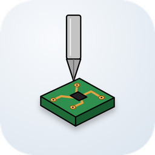
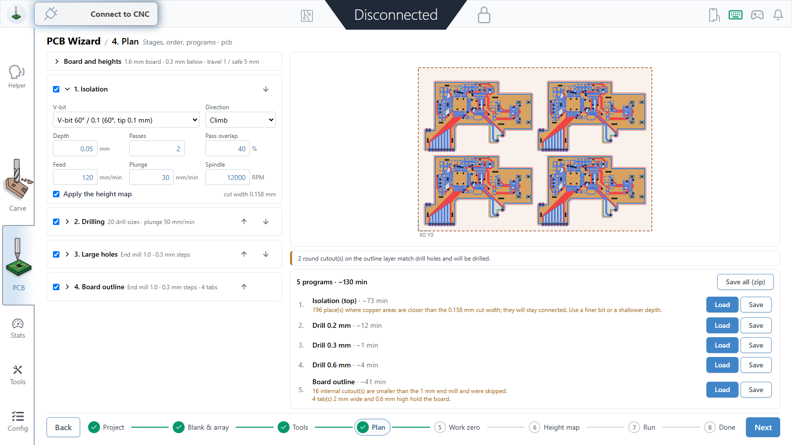
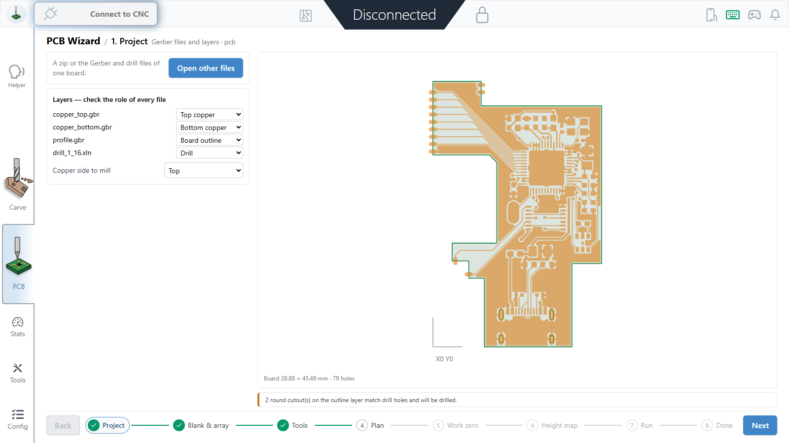
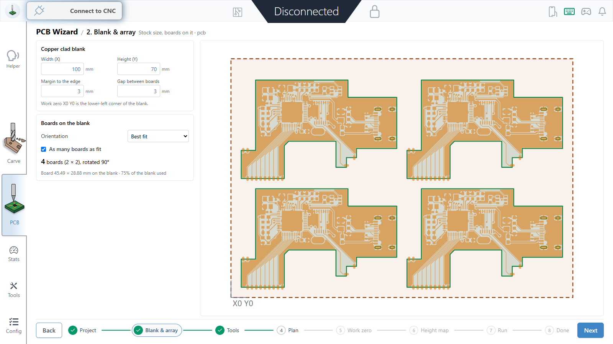
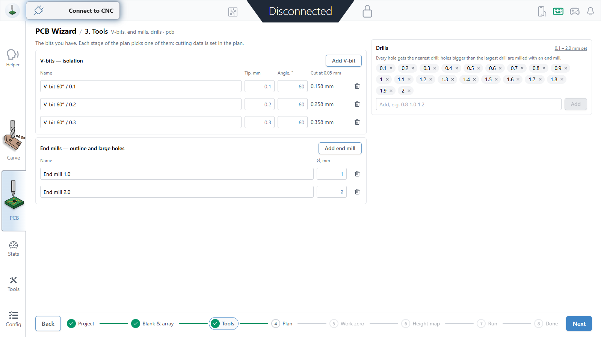
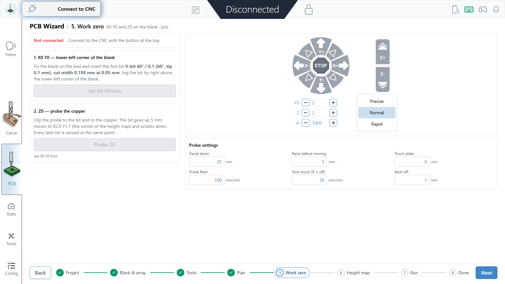
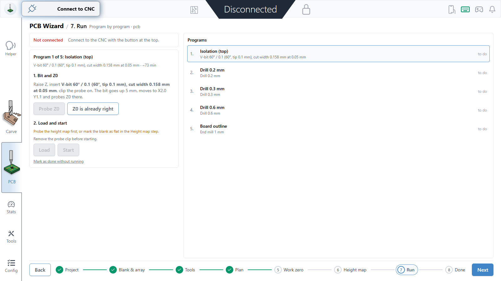

<p align="center">
  
</p>

<h1 align="center">G-PCB</h1>

<p align="center">
  <b>Mill printed circuit boards on a GRBL CNC, step by step.</b><br>
  Gerber files in, finished boards out: board arrays, isolation, drilling, outline with tabs,<br>
  a probed height map and guided bit changes, all in one place.
</p>

<p align="center">
  <a href="https://github.com/ToxaToxaToxa/G-PCB/releases/latest"><b>⬇ Download for Windows</b></a>
  ·
  <a href="#building">Build from source</a>
  ·
  <a href="#version-notes">What's new</a>
</p>



## Why

Milling a PCB on a hobby CNC usually means juggling several programs: one to turn Gerbers into G-code, another to probe the copper, a sender to run it, and a notebook to remember which bit comes next and where Z0 was. G-PCB puts the whole job into one guided workflow inside the CNC sender itself, so the machine, the probe and the programs work from the same zero.

## The PCB wizard

**PCB** sits in the main menu next to Carve. The steps run along the bottom of the screen; any finished step can be opened again.

| | |
|---|---|
| **1. Project** — open a zip or the Gerber and drill files from Fusion 360 / EAGLE, KiCad, EasyEDA and others, and check the role of every layer. A frame drawn around the board (EAGLE's default 160 × 100 mm board, for example) is recognised. |  |
| **2. Blank & array** — enter the copper clad blank, margins and the gap between boards. G-PCB places as many copies as fit, rotating the board when more fit that way, or the array you ask for. Work zero is the lower-left corner of the blank. |  |
| **3. Tools** — your V-bits with the cut width at the chosen depth, end mills, and the drills you own. |  |
| **4. Plan** — isolation, drilling, large holes and the board outline with tabs. Choose the order, the bit and the cutting data of every stage; each program covers all boards on the blank. Warnings show places a bit cannot isolate. Programs can be loaded, saved, or downloaded together as a zip. |  |
| **5. Work zero** — jog to the blank corner and set X0 Y0, then probe Z0 on the copper at a fixed reference point. |  |
| **6. Height map** — the probe touches the copper on a grid over the isolation area; the isolation program then follows the real surface of the blank. | |
| **7. Run** — program by program: G-PCB asks for the next bit, raises Z, probes Z0 again at the same reference point (so the height map stays valid), loads the program and starts it on your click. Programs started from the Carve screen are tracked too. |  |
| **8. Done** — a summary, or the same boards again on a new blank. | |

The machine never moves on its own: every probe, every start is a button you press, and the start stays disabled until the machine is idle and Z0 is set for the bit in the spindle.

### Also in Tools

- **PCB Milling** — the same toolpath engine on one page, for a single board.
- **Height Map** — probe a height map and apply it to any loaded G-code.

### Current limits

- Single-sided boards (top or bottom copper, mirrored for the bottom).
- Windows installer only; the code builds for macOS and Linux like gSender, but those builds are untested.

## Install

Download `G-PCB-<version>-x64.exe` from the [latest release](https://github.com/ToxaToxaToxa/G-PCB/releases/latest) and run it. The installer is not code-signed, so Windows SmartScreen may warn: choose *More info → Run anyway*.

G-PCB installs next to gSender, not over it: it has its own application id and keeps its settings in `%APPDATA%\G-PCB`. It checks this repository for updates on start and offers them; nothing is downloaded without asking.

## Building

Requires Node.js 24 and Yarn 1, on Windows with Git Bash.

```sh
yarn install
npm run package-sync
yarn --cwd src install --production --ignore-scripts --non-interactive
yarn run build-latest
yarn run build:windows        # installer in output/
```

A release build keeps the plain version number the updater expects:

```sh
npm run prebuild-prod
yarn run build
yarn run build:windows        # G-PCB-<version>-x64.exe, .blockmap and latest.yml
```

Attach those three files to a GitHub release tagged `v<version>`. The `version` in `package.json` is the G-PCB version; `gsenderVersion` is the gSender release G-PCB is based on and drives the settings migrations.

### Updating from gSender

G-PCB keeps gSender's full history, so new gSender releases merge in like any other branch:

```sh
git remote add upstream https://github.com/Sienci-Labs/gsender.git
git config remote.upstream.tagOpt --no-tags   # gSender's old v1.0.x tags would clash with G-PCB's
git fetch upstream
git merge upstream/master                     # or the commit of a gSender release
```

Conflicts can only come from places G-PCB changed: branding (`package.json`, `src/main.js`, icons, splash), telemetry setup, the navigation and routes, and the README. Afterwards set `gsenderVersion` in `package.json` to the merged gSender release, run the tests, and release a new G-PCB version.

The PCB code lives in `src/app/src/features/PcbWizard`, `PcbMilling` and `HeightMap`; tests run with `node_modules/.bin/jest --config jest.config.js --testPathPatterns="PcbWizard|PcbMilling|HeightMap"`.

## Privacy

Crash reports go to the G-PCB Sentry project without personal data. Usage statistics are off. Builds made from this repository send nothing unless you put your own keys in `.env` (see `.env.example`).

## Credits and license

G-PCB is built on [gSender](https://github.com/Sienci-Labs/gsender) by Sienci Labs — the CNC sender, visualizer, jogging, probing and everything else outside the PCB features comes from there. G-PCB is an independent project, not made, endorsed or supported by Sienci Labs. The original gSender README is kept in [docs/gsender-README.md](docs/gsender-README.md).

The test boards come from [pcsx-redux](https://github.com/grumpycoders/pcsx-redux/tree/main/hardware) (GPL-2.0) and the [Modxo RP2040 Zero adapter](https://github.com/m4x10187/Modxo_RP2040_Zero_Adapter) (CERN-OHL-P-2.0).

G-PCB is free software under the [GNU General Public License v3](LICENSE), like gSender.

## Version notes

<details>
<summary>Expand to see all version notes</summary>

### 1.0.4 (October 6, 2026)
- A window announces new G-PCB versions with their release notes, with Update and Later; it never appears during a job, and updating is blocked until the job ends
- The update page, release notes and GitHub links point to G-PCB instead of gSender

### 1.0.3 (October 6, 2026)
- Fixed a crash when an Ethernet (telnet) connection could not reach the machine, for example ENETUNREACH on 192.168.5.1 with no network cable: the error is now shown instead of closing G-PCB

### 1.0.2 (September 27, 2026)
- Start is allowed only when the loaded file is the program's current G-code, so an isolation program loaded before the height map was probed can no longer run without it
- Z0 is recorded for the bit that was probed, even if another program was selected meanwhile
- Wizard settings (tools, drills, blank, stage order, probe) are kept after a restart
- Height map notes, such as toolpath points outside the probed area, are shown in the Plan and Run steps
- Changing the plan during a job keeps "done" only for unchanged programs and asks for a new height map and Z0 when the isolation area moved
- A fixed board array that does not fit is cut down to the boards that fit, never placed past the blank
- Height map: no invalid X NaN moves in relative (G91) mode after an unreadable arc
- No usage statistics consent dialog while the build has no statistics project

### 1.0.1 (September 27, 2026)
- New G-PCB splash screen and application icon everywhere
- Updates and links point to the renamed ToxaToxaToxa/G-PCB repository
- These notes in the app now describe G-PCB instead of gSender

### 1.0.0 (September 27, 2026)
- First release: PCB section with the eight-step wizard, from Gerber files to finished boards
- Board arrays on a blank with best-fit rotation; frames around a board are recognised
- Isolation, drilling, large hole milling and outline with tabs for all boards on the blank
- Work zero, Z0 probing at a fixed reference point, height map probing, guided bit changes
- Programs started from the Carve screen are tracked by the wizard
- Based on gSender 1.6.4

</details>
